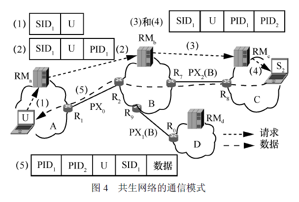
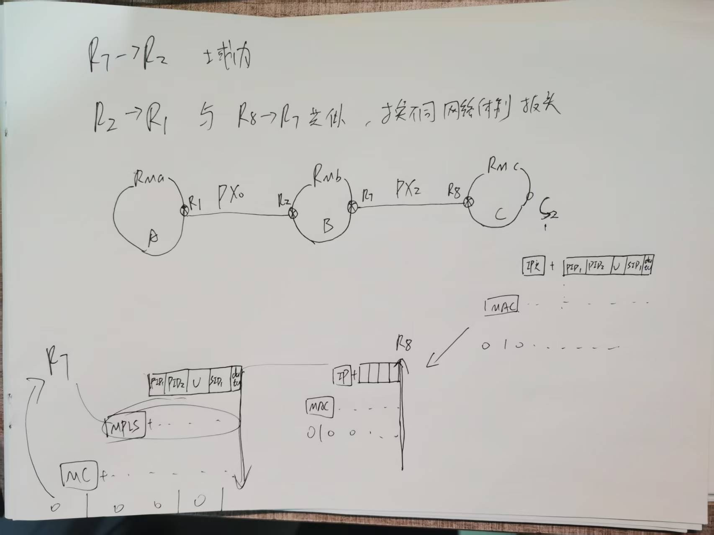
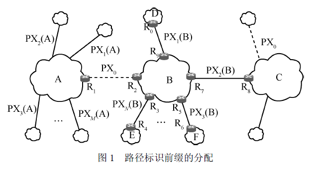

## 问题

- [x] 域内路由与域间路由的解耦的实现，入口路由与出口路由的处理，一个节点发送信息怎么确定跨网络还是不跨网络

不同的自治系统内部使用各自的网络层协议或路由协议，共生网络采用“以拉促推、推拉结合”的跨域通信模式

请求消息的发送论文中已经详细给出

以上图为例，当S2收到RMc 发来的请求消息，得知请求消息为 `SID1+U+PID1+PID2` 

1. S2首先查询RMc知道PID2，首先将分组发送给路由器R8（域内传输，假设网络C采用的IP协议，构造的分组如下：`IP头+SID1内容分组+U的NID+PID1+PID2`
2. 分组到达R8时，查询路由表得知PID2对应的下一跳节点为R7，下一跳网络为B，假设采取的协议为MPLS，构造的分组为：`MPLS头+SID1内容分组+U的NID+PID1+PID2`（**分组在跨越某种体制的网络时，可以在相应入口路由器处封装上该网络体制的报头，然后用该报头将分组转发到相应的出口路由器，最后由出口路由器将相应报头解封，并转发给下一个网络**）实现了域内域间的解耦
3. 当分组到达R7时，根据域间路径标识PID1，可知应该将分组发送给边界路由器R2，构造的分组形式如上（域内传输）
4. 重复上述过程，R2根据PID1传输分组给R1，R1得到`SID1+U+PID1+PID2`
5. R1根据U的NID知道将分组传送给U（域内传输）

- [x] RM怎么初始化，所有节点先发一次信息？？

一个数据要被合法发送到外网，数据提供者必须要将该数据的内容名字通告给外网。

- [x] SID前缀是什么 NID么？

NID的构成 = IANA分配的IP + public_key

- [x] 一个节点发出请求，才会有回应，怎么拉取？节点怎么事先知道别的节点拥有的内容，SID构建，内容的哈希值先计算吗

节点会把数据的内容名字通告

- [ ] PID序列在请求过程中形成，那么在**数据传输**过程中逐个被丢弃的吗还是一直保留？

都是一直保留，便于精准溯源，**但是路由器是怎么匹配PID序列中的对应的PID**？

- [ ] RM表项岂不是会很大很大，每个网络的RM都要记录全网络的NID（SID聚合）？怎么实现，类似于DNS吗？？？

- [ ] RM的内容会不会随着时间的推移，删除无用的路径？例如两个网络之间的PX无效了怎么办，同一个SID可能有多个表项，路由时选择哪个

- [ ] PX分配和更新

## 背景

## 两个问题

1. 科学问题1 异构网络互联而成的网络空间的普适表征问题。
2. 科学问题2 多维名字空间的协同与耦合问题。

## 共生网络

* 针对科学问题1，提出共生网络对异构体制网络互联而成网络空间的普适表征机理。

* 针对科学问题2，基于前述普适表征机理，给出共生网络的体系结构模型，建立共生网络的基本工作机理和共生网络的跨域安全保障机理。

### 普适表征机理

**传递信息** 是互联网（或者网络空间）的功能本质，涉及以下5 个相互独立的自然属性：

1. 传什么（即内容属性），
2. 传给谁（即身份属性），
3. 传到哪（即位置属性），
4. 怎么传（即手段属性），
5. 何时传（即时间属性）。由于网络空间的信息传递绝大多数情况下是即时的，且已有对时间的普适表征方法（即年、月、日、
   时、分、秒），不再单独考虑时间属性，而是在共生网络的工作机理、安全保障机理中利用时间属性。

共生网络利用以下4 个名字空间对异构网络互联而成的网络空间进行普适化表征：**内容名字，即SID（ service identifier）**，用于表征传什么；**节点标识（NID, node identifier）**，用于表征传给谁；**各类地址（address）**，用于表征传到哪；**路径标识（PID, path identifier）**，用于表征怎么传。

#### 内容名字

跨异构网络传输时：

**SID = NID + N**

#### 节点标识

**NID 为该节点的节点标识**，N 为该节点为该内容生成的唯一标识，对静态内容而言，N 为内容的哈希，对动态内容或者服务而言，N 由节点NID 指定。采
用这种层次化的内容名字，便于网络间通告内容名字时进行内容名字的聚合（类似IP 前缀聚合），从而保障网络的规模可扩展性。

**NID = IP + pubilc_key** 

> IP:32bit 
>
> public_key:128bit

#### 各类地址

每种网络体制可以有自己的地址，如IPv4、IPv6、地理坐标等，**便于根据网络特点在网内进行分组转发**，从而充分发挥该网络的优势。这样，共生网络可以兼容现有的IPv4、IPv6 等网络体制，从而实现各种不同网络的共生融合。

#### 路径标识

共生网络采用分组交换的方式跨域传递信息。与IPv6试图替代IPv4 不同，共生网络旨在利用已有的各种网络进行分组转发。分组在跨越某种体制的网络时，可以在相应入口路由器处封装上该网络体制的报头，然后用该报头将分组转发到相应的出口路由器，最后由出口路由器将相应报头解封，并转发给下一个网络（类似IP 分组跨越数据链路层异构的网络）。因此，**共生网络重点关注异构网络之间的分组转发。**

> 以采用IP协议的某网络为例：在入口路由器处分组封装为         IP 头部+分组

异构网络之间的互联方式繁多，同时，2 个网络之间的连接通道也可能不是一条，而是多条；即使只有一条通道，该通道中2 个网络的端点也可能随着时间变化，**因此，共生网络不关注某种具体的连接方式，而是对这些连接方式进行统一抽象。**

共生网络对网络间的域间路径（代表社会关系）进行命名。具体而言，**共生网络为每条域间路径分配一个域间路径标识前缀PX。假定域间路径标识的长度为L bit，路径标识前缀PX 的长度为l bit，则PX 代表2^L−l^ 个连续的域间路径标识，其中第一个域间路径标识能够被2^L−l^ 整除**。例如，设L = 32，l = 24， 则路径标识前缀192.168.10.0/24 代表了192.168.10.0, 192.168.10.1, …, 192.168.10.255 共256 个连续的域间路径标识。

由于域间路径的数量众多，**共生网络按照“正交复用”的原则为域间路径分配域间路径标识前缀**。给定2 个网络A 和B，以及A 和B 间的一条域间路径P0，此外分别有M 和N 条域间路径。记A、B 与所有相邻网络的域间路径集合分别为

P(A)={P0,P1(A), P2(A),…, PM (A)} (1)

P(B) = {P0, P1(B), P2(B),…, PN (B)} (2)

记PXj (Y)为域间路径Pj (Y)的域间路径标识前缀，其中Y 代表A 或B，j=1,2,…,max(M, N)，路径标识前缀的分配如图1 所示。**正交分配是指任意给定j ≠ 0，PX j(Y)与PX0 没有交集，即没有相同的域间路径标识**。然而，**在满足正交分配的原则下，PX0可以被网络中的多条域间路径复用，从而避免集中分配域间路径标识，既降低分配域间路径标识的复杂性，又防止垄断**。例如，PX0 可以同时分配给图1中虚线示意的两条域间路径。

>可以复用，因为每个网络的边界路由器的路由表的每一项“只关注邻域”，记录着到达邻域的PID前缀、下一跳节点以及通信方式。

### 共生网络的体系结构模型

### 共生网络的基本工作机理

共生网络的基本工作机理包含三方面：

* 域内域间解耦的路由组织模式、
* 内容名字驱动的跨域互联模式、
* “以拉促推、推拉结合”的跨域通信模式，

#### 域内域间解耦的路由组织模式

**路由器R2 的域间路由表**：

| PID 前缀 | 邻域 | 下一跳节点 | 通信方式 |
| -------- | ---- | ---------- | -------- |
| PX0      | A    | R1         | MPLS     |
| PX1(B)   | D    | R9         | IPv4     |
|          |      |            |          |
|          |      |            |          |
|          |      |            |          |
|          |      |            |          |

>域内域间解耦的实现：例如，图1 中边界路由器R2 的域间路由表如表1 所示；其中设网络B 采用IPv4，且网络A 的边界路由器R1 和网络B 的边界路由器R2
>之间使用多协议标签交换（MPLS, multi-protocol labelswitching），**通过封装MPLS 报头可将分组从边界路由器R2 发给R1**

#### 内容名字驱动的跨域互联模式

尽管不同网络体制采用的名字空间、分组格式等不同，但它们的功能本质相同，即传递信息。因此，共生网络为网络中的信息（或内
容）命名，并在网络间通告内容名字的可达性，屏蔽网络异构性的同时实现跨域互联。

共生网络在每个网络部署一个逻辑上集中但可分布式实现的资源管理器（RM, resource manager），以层叠的方式在该网络运行。每个资源管理器维护一个内容路由表，记录内容名字的可达性。内容路由表中的每个路由条目对应一个内容名字（前缀），记录去往相应内容提供者的下一跳节点，去往内容提供者的下一跳网络、该资源管理器所在网络与下一跳网络之间的域间路径标识前缀等信息

**资源管理器RMb 维护的内容路由表：**

| SID(前缀) | 下一跳节点 | 下一跳网络 | PID前缀 |
| --------- | ---------- | ---------- | ------- |
| SID1      | R7         | C          | PX2(B)  |
| SID2      | R7         | C          | PX2(B)  |
| SID3      | R9         | D          | PX1(B)  |
| ···       | ···        | ···        | ···     |

当一个内容提供者要将某个内容向其他网络提供时，该内容提供者首先向其本地资源管理器通告相应内容名字。内容名字（前缀）通告如图3 所示，当内容提供者S2 有名为SID1和SID2 的内容要向外提供时，其先将SID1 和SID2 通告给本地资源管理器RMc。本地资源管理器收到该内容名字通告后，首先检查其内容路由表中是否记录有相应内容名字的表项。如果有，则检查内容提供者与表项中记录的内容提供者是否相同；如果相同，则更新相应条目的TTL（time tolive）值。如果内容路由表中没有记录相应的内容名字，或者记录的下一跳节点与通告消息中的内容提供者不同，则为该内容名字增加一个表项，表项中的下一跳节点为发送该内容名字通告的节点，下一跳网络和PID 前缀为空。之后，本地资源管理器根据策略将该内容名字通告消息发送给邻域；如图3 所示，RMc将通告消息发送给RMb。

>节点会主动通告所要提供的内容，向**本地的资源管理器**通告
>
>本地资源管理器首先检查是否有相应的内容名字的前缀
>
>> 有且内容提供者相同，更新TTL
>
>> 若没有或者记录的节点不一致，则增加一个表项，下一跳节点为发送该内容名字通告的节点，下一跳网络和PID 前缀为空（因为是在本网络中）
>
>同一个节点发送的信息前缀；不同的原因是使用的public_key不同，因为NID = IP + public_key

资源管理器在将内容名字通告消息发送给邻域之前，**需将资源管理器所在网络和邻域之间的域间路径标识前缀添加到内容名字通告消息中**。这样，资源管理器所在网络的边界路由器可以根据该域间路径标识前缀将该通告消息发送给邻域；同时，邻域的资源管理器收到该内容名字通告消息后，也可以知道该内容名字通告消息来自哪个网络。

当资源管理器收到从邻域发来的内容名字通告消息时，检查其内容路由表中是否记录有相同内容名字的表项。如果有，则检查表项中的下一跳网络是否与内容名字通告消息中携带域间路径标识前缀对应的邻域相同；如果相同，则更新相应条目的TTL 值。**如果内容路由表中没有记录相应的内容名字，或者记录的下一跳网络与内容名字通告消息中对应的网络不同，则为该内容名字增加一个表项，表项中的域间路径标识前缀通告消息中携带域间路径标识前缀，下一跳网络为该域间路径标识前缀对应的邻域。**例如图3 中，当资源管理器RMb接收到从邻域C 发来的内容名字通告消息时，则将内容名字SID1 和SID2 加入其内容路由表，如表2中第一行和第二行所示。此后，资源管理器根据策略，将该通告消息发送给邻域。

>有几种不同的情况
>
>1. 节点的内容名字已经通告过了，并且网络的结构，或者说数据的经过的路径没变（即PID前缀），更新TTL
>2. 节点没有被通告过，新增表项
>3. 数据有新的来的路线，即通过不同的PX来到此资源管理器，新增表项

由于内容名字的层次化设计，资源管理器可以对邻域通告的内容名字进行聚合。例如表2 中，当SID1 和SID2 中的NID 部分相同时，RMb可以将这2 个表项聚合成一个只包含NID的表项。通过聚合，可以减少内容路由表的条目数量和内容名字通告数量，保障网络的规模可扩展性。

#### “以拉促推、推拉结合”的跨域通信模式

内容提供者S2 收到RMc 发来的请求消息时，通过请求消息中的SID1，得知用户U 需要的内容；通过请求消息中携带的域间路径标识PID2 和PID1，得知去往用户U
的域间路径。此时，内容提供者S2 将SID1 对应内容以分组的形式推送给用户U，**其中每个分组都应携带域间路径标识PID2 和PID1，用户U 的节点标识以及SID1。**

### 安全保障机理

1. 攻击数据进不来
2. 隐私数据出不去

#### 基于路径标识耦合生成的跨域攻击防范机理

PID = PX (l bit) || HMAC (L−l bit)

||为连接运算符，将l bit 的PX 与L−l bit 的HMAC 连接成L bit 的域间路径标识PID；HMAC按照下式耦合生成。
HMAC = f (NID, SID, SN, PX, PID0)

f(•)为单向散列函数，既便于资源管理器高效计算，又难以被其他节点伪造（因为不知道SN）[18]。当该资源管理器的边界路由器收到一个分组时，根据上述域间路径标识的生成机理，校验分组中携带域间路径标识的合法性。只有当域间路径标识合法时，才继续转发该分组；否则，丢弃该分组。

>SN是一个私密的随机数，并且f是一个单向的哈希函数，所以想要逆向很困难。
>
>而且，计算HMAC 时，使用了上一跳域间路径标识PID0，从而将请求消息和分组经过的所有域间路径“链接”起来，使攻击者更难伪造合法的域间路径标识。（类似于区块链）

#### 基于多维名字逐分组过滤的数据泄露防范机理
为了实现隐私数据出不去，**内容提供者所在网络的资源管理器和边界路由器**基于多维名字空间，对出网数据分组进行逐分组过滤。为此，边界路由
器维护一个请求列表；该列表中的每一个条目对应一个内容名字，记录了以下信息。

## 系统验证与能力生成

### 跨域攻击防范能力

共生网络的域间路径标识耦合生成机理，用节点标识、内容名字等信息耦合生成域间路径标识，使**攻击者难以伪造域间路径标识**。结合共生网络以“拉促推、推拉结合”的跨域通信模式，**使一个节点只有收到请求者发送的请求并从中获得合法域间路径标识（序列），该节点才能将数据分组发送到请求者；否则，数据分组会因为携带的域间路径标识非法而被边界路由器丢弃，而不能到达请求者**。正因如此，共生网络能够从根本上防范IP 网络中广泛存在的反射攻击。

共生网络中的内容提供者要将内容名字通告给外网，且要接收外网发来的请求消息。因此，共生网络中的内容提供者有可能遭受请求分组攻击，即攻击者通过发送大量请求消息来实施攻击。

>如果发送合法的请求内容进行攻击，易形成针对攻击者自身的反射攻击
>
>若攻击者通过发送非法请求进行攻击，则由于请求的内容名字不存在，会被资源管理器报告非法从而丢弃，。此时，请求消息中携带的域间路径标识（序列），可以被用于对攻击者的精准溯源，从而阻止攻击[

### 数据泄露防范能力

1. 节点向外网通告内容时，本地资源管理器会进行管理
2. 网络的边界路由器会维护一个请求表，防止隐私数据泄露

### 精准实时溯源能力

共生网络中，请求消息和数据分组均携带域间路径标识（序列）

## **相较于BGP的优势**

| **维度**       | **BGP**                                  | **共生网络**                                      |
| :------------- | :--------------------------------------- | :------------------------------------------------ |
| **协议依赖性** | 仅支持IP网络互联                         | 支持IP/NDN/SCION等异构网络互联                    |
| **路由表规模** | 全局路由表>93万条（前缀碎片化）          | 域间路由表<4万条（仅记录邻域PX）                  |
| **安全性**     | 依赖防火墙、ACL等外挂机制                | 内生安全（PID动态校验、推拉通信模式）             |
| **移动性支持** | 频繁路由更新（如卫星网络切换时性能下降） | PID前缀稳定，仅需更新端点（如无人机边界节点切换） |

